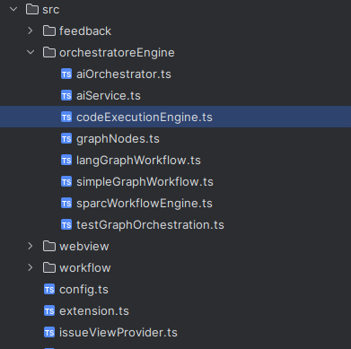

## 🏗️ **Architecture Overview**

Mira is architected for modular, persistent, and orchestrated AI workflows:

- **SPARC Workflow Engine**: Core orchestration system managing Design → Build → Debug transitions
- **Issue Management System**: Persistent issue folders with structured metadata and state tracking
- **Tool Integration Layer**: Built-in tools + MCP server support for external capabilities
- **File System Integration**: Direct project manipulation with version control awareness
- **State Persistence**: All workflow state stored in `.nys/` directory for session continuity. 
  
