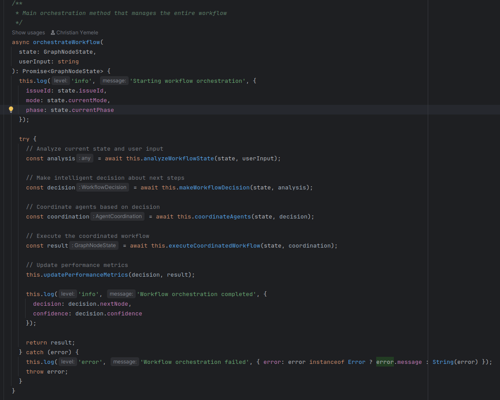
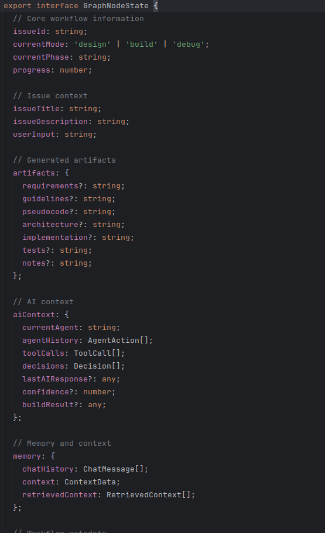
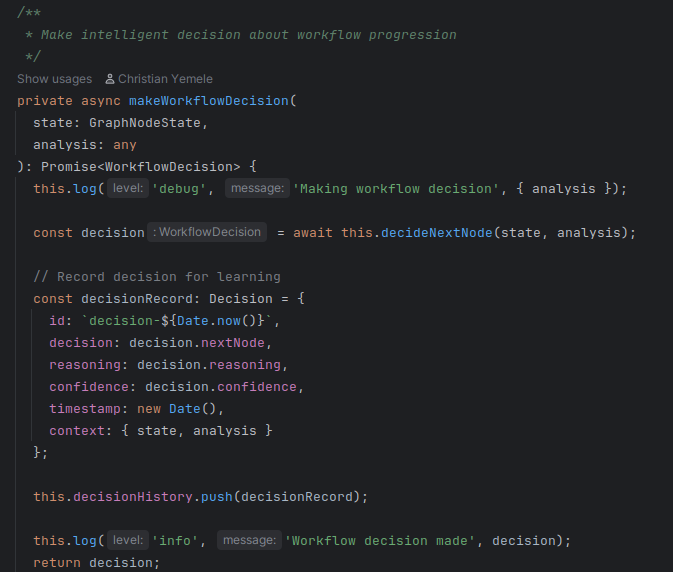
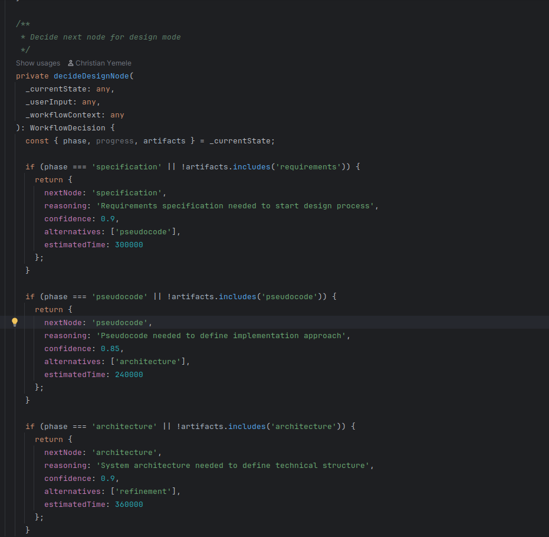

## Orchestrator and GraphNodes
Each step in the SPARC workflow occurs in nodes and these nodes chained to each other, either by a sequential, parallel or
conditional edge. building GraphNodes and we have agents in each of these nodes orchestrating flow from one Node to another

### GraphNodeState
Nodes refers to each step in th SPARC workflow and are grouped into 3 categories
- Design Nodes
- Build Nodes
- Debug Nodes
  The GraphNodeState shows in initial state of the graph (similar to Langgraph's). 
  

### Decision Workflow

