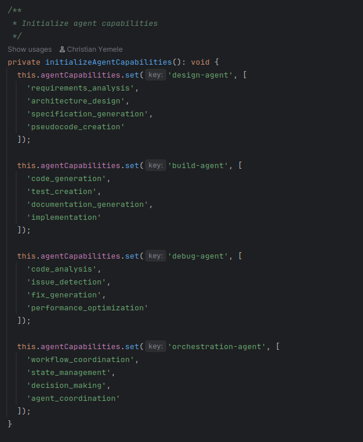

## Agents
Agents are the intelligent brains in the nodes execution they do this by their base systemprompts
which triggers the way the llm provide responses from their inputs
Each step in the SPARC workflow falls in a particular agent group. 
