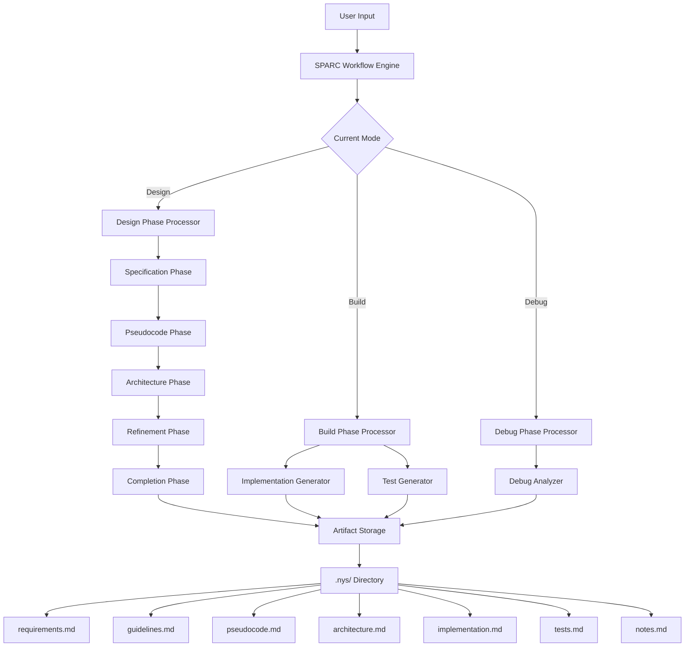

# SPARC Workflow Engine - Comprehensive Documentation

## Table of Contents
1. [Overview](#overview)
2. [Architecture](#architecture)
3. [Core Components](#core-components)
4. [Workflow Phases](#workflow-phases)
5. [API Reference](#api-reference)
6. [Data Structures](#data-structures)
7. [File System Integration](#file-system-integration)
8. [Usage Examples](#usage-examples)
9. [Extension Points](#extension-points)
10. [Best Practices](#best-practices)

## Overview

The **SPARC Workflow Engine** is the core orchestration system that implements the SPARC framework (Specification → Pseudocode → Architecture → Refinement → Completion) for systematic, issue-driven development. It transforms user requirements into structured development artifacts through a guided workflow process.

### Key Features
- **Issue-Driven Development**: Each development task becomes a tracked issue with persistent state
- **Progressive Workflow**: Structured progression through 5 distinct phases
- **Artifact Generation**: Automatic creation of requirements, code, tests, and documentation
- **Persistent State Management**: All workflow data stored in `.nys/` directory
- **Mode-Aware Processing**: Different behaviors for Design, Build, and Debug modes

## Architecture



## Core Components

### 1. SPARCWorkflowEngine Class

The main orchestrator class that manages the entire workflow lifecycle.

```typescript
export class SPARCWorkflowEngine {
  private _nysFolder: vscode.Uri | null = null;
  
  constructor(private readonly workspaceRoot: vscode.Uri)
  
  // Public API
  public async processIssue(issueId: string, mode: 'design' | 'build' | 'debug', userInput: string): Promise<SPARCWorkflowState>
  
  // Private methods
  private async processDesignPhase(state: SPARCWorkflowState, userInput: string): Promise<void>
  private async processBuildPhase(state: SPARCWorkflowState, userInput: string): Promise<void>
  private async processDebugPhase(state: SPARCWorkflowState, userInput: string): Promise<void>
}
```

### 2. SPARCWorkflowState Interface

Defines the complete state of a workflow instance.

```typescript
export interface SPARCWorkflowState {
  issueId: string;                    // Unique identifier for the issue
  currentPhase: 'specification' | 'pseudocode' | 'architecture' | 'refinement' | 'completion';
  mode: 'design' | 'build' | 'debug'; // Current workflow mode
  progress: number;                   // Progress percentage (0-100)
  artifacts: {                        // Generated artifacts
    requirements?: string;
    guidelines?: string;
    pseudocode?: string;
    architecture?: string;
    implementation?: string;
    tests?: string;
    notes?: string;
  };
  createdAt: Date;                    // Creation timestamp
  updatedAt: Date;                    // Last update timestamp
}
```

## Workflow Phases

### Design Mode Phases

The Design mode follows a strict 5-phase progression:

#### 1. Specification Phase (0-25%)
**Purpose**: Extract and formalize requirements from user input
**Input**: Raw user requirements/description
**Output**: Structured requirements document
**Artifacts Generated**: `requirements.md`

```typescript
private async generateRequirements(userInput: string): Promise<string> {
  return `# Requirements Specification
## User Input
${userInput}
## Extracted Requirements
- Core functionality: [To be defined based on input analysis]
- Technical constraints: [To be identified]
- Performance requirements: [To be specified]
- Integration points: [To be mapped]
## Acceptance Criteria
- [ ] Feature 1: [Description]
- [ ] Feature 2: [Description]
- [ ] Feature 3: [Description]`;
}
```

#### 2. Pseudocode Phase (25-50%)
**Purpose**: Create high-level algorithm design
**Input**: User input + requirements artifact
**Output**: Algorithmic pseudocode
**Artifacts Generated**: `pseudocode.md`

```typescript
private async generatePseudocode(userInput: string, requirements?: string): Promise<string> {
  return `# Pseudocode
## Algorithm Overview
Based on requirements analysis, here's the high-level algorithm:
\`\`\`
BEGIN
  // Initialize system components
  INITIALIZE components
  // Main processing loop
  FOR each input item DO
    PROCESS item according to requirements
    VALIDATE output
    STORE result
  END FOR
  // Cleanup and finalization
  CLEANUP resources
  RETURN results
END
\`\`\``;
}
```

#### 3. Architecture Phase (50-75%)
**Purpose**: Design system architecture and components
**Input**: User input + all previous artifacts
**Output**: System architecture and development guidelines
**Artifacts Generated**: `architecture.md`, `guidelines.md`

```typescript
private async generateArchitecture(userInput: string, artifacts: any): Promise<string> {
  return `# System Architecture
## Overview
High-level system design based on requirements and pseudocode analysis.
## Components
- **Core Module**: Main processing logic
- **Data Layer**: Data persistence and retrieval
- **Interface Layer**: External API and user interface
- **Validation Layer**: Input/output validation
## Dependencies
- Framework: [To be specified]
- Database: [To be specified]
- External APIs: [To be identified]`;
}
```

#### 4. Refinement Phase (75-100%)
**Purpose**: Refine and finalize requirements based on architecture
**Input**: User input + requirements artifact
**Output**: Refined requirements
**Artifacts Generated**: Updated `requirements.md`

```typescript
private async refineRequirements(requirements: string, userInput: string): Promise<string> {
  return requirements + `\n\n## Refinements\n[${new Date().toISOString()}] ${userInput}\n\n*Refined based on user feedback*`;
}
```

#### 5. Completion Phase (100%)
**Purpose**: Mark design phase as complete
**Input**: All design artifacts
**Output**: Design completion status
**Next**: Ready for Build mode

### Build Mode

**Prerequisites**: Design phase must be complete (currentPhase === 'completion')
**Purpose**: Generate implementation code and tests
**Artifacts Generated**: `implementation.md`, `tests.md`

```typescript
private async processBuildPhase(state: SPARCWorkflowState, userInput: string): Promise<void> {
  if (state.currentPhase !== 'completion') {
    // Build phase requires design to be complete
    state.artifacts.notes = (state.artifacts.notes || '') + 
      `\n[${new Date().toISOString()}] Build requested but design incomplete. Current phase: ${state.currentPhase}`;
    return;
  }

  // Generate implementation based on design artifacts
  state.artifacts.implementation = await this.generateImplementation(userInput, state.artifacts);
  state.artifacts.tests = await this.generateTests(userInput, state.artifacts);
  
  state.progress = 100;
}
```

### Debug Mode

**Purpose**: Analyze and debug existing code/artifacts
**Input**: Any existing artifacts + debug request
**Output**: Debug analysis and recommendations
**Artifacts Generated**: Updated `notes.md`

```typescript
private async processDebugPhase(state: SPARCWorkflowState, userInput: string): Promise<void> {
  // Debug phase can work with any existing artifacts
  const debugNotes = await this.analyzeAndDebug(userInput, state.artifacts);
  state.artifacts.notes = (state.artifacts.notes || '') + 
    `\n[${new Date().toISOString()}] Debug Analysis:\n${debugNotes}`;
}
```

## API Reference

### Main Processing Method

```typescript
public async processIssue(
  issueId: string, 
  mode: 'design' | 'build' | 'debug', 
  userInput: string
): Promise<SPARCWorkflowState>
```

**Parameters:**
- `issueId`: Unique identifier for the issue
- `mode`: Current workflow mode (design/build/debug)
- `userInput`: User's input/request for processing

**Returns:**
- `Promise<SPARCWorkflowState>`: Updated workflow state with generated artifacts

**Example Usage:**
```typescript
const engine = new SPARCWorkflowEngine(workspaceRoot);
const state = await engine.processIssue('issue-123', 'design', 'Create a user authentication system');
console.log(`Current phase: ${state.currentPhase}, Progress: ${state.progress}%`);
```

## Data Structures

### Workflow State Structure

```typescript
interface SPARCWorkflowState {
  issueId: string;                    // "issue-1234567890"
  currentPhase: string;               // "specification" | "pseudocode" | "architecture" | "refinement" | "completion"
  mode: string;                       // "design" | "build" | "debug"
  progress: number;                   // 0-100
  artifacts: {
    requirements?: string;            // Markdown requirements document
    guidelines?: string;              // Markdown development guidelines
    pseudocode?: string;              // Markdown pseudocode document
    architecture?: string;            // Markdown architecture document
    implementation?: string;          // Markdown implementation document
    tests?: string;                   // Markdown test suite document
    notes?: string;                   // Markdown debug notes
  };
  createdAt: Date;                    // ISO timestamp
  updatedAt: Date;                    // ISO timestamp
}
```

### Artifact File Mapping

| Artifact Key | File Name | Purpose |
|--------------|-----------|---------|
| `requirements` | `requirements.md` | Technical specifications and acceptance criteria |
| `guidelines` | `guidelines.md` | Coding standards and development guidelines |
| `pseudocode` | `pseudocode.md` | Algorithm design and logic flow |
| `architecture` | `architecture.md` | System design and component structure |
| `implementation` | `implementation.md` | Generated source code and configuration |
| `tests` | `tests.md` | Test suites and validation code |
| `notes` | `notes.md` | Debug analysis and iteration notes |

## File System Integration

### Directory Structure

```
workspace-root/
└── .nys/                           # SPARC workflow data directory
    ├── issue-1234567890/           # Issue-specific folder
    │   ├── requirements.md         # Requirements specification
    │   ├── guidelines.md           # Development guidelines
    │   ├── pseudocode.md           # Algorithm pseudocode
    │   ├── architecture.md         # System architecture
    │   ├── implementation.md       # Generated implementation
    │   ├── tests.md                # Test suite
    │   └── notes.md                # Debug notes
    ├── issue-1234567890-workflow.json  # Workflow state file
    ├── issue-0987654321/           # Another issue folder
    └── issue-0987654321-workflow.json
```

### State Persistence

The engine maintains two types of persistence:

1. **Workflow State File**: `{issueId}-workflow.json`
   - Contains complete workflow state
   - Includes metadata, progress, and artifact references
   - Updated on every workflow operation

2. **Artifact Files**: Individual `.md` files in issue folders
   - Human-readable artifact content
   - Version-controlled friendly
   - Directly editable by developers

### File Operations

```typescript
// Load workflow state
private async loadWorkflowState(issueId: string): Promise<SPARCWorkflowState | null> {
  const stateFile = vscode.Uri.joinPath(this._nysFolder, `${issueId}-workflow.json`);
  const content = await vscode.workspace.fs.readFile(stateFile);
  return JSON.parse(content.toString());
}

// Save workflow state and artifacts
private async saveWorkflowState(state: SPARCWorkflowState): Promise<void> {
  // Save state file
  const stateFile = vscode.Uri.joinPath(this._nysFolder, `${state.issueId}-workflow.json`);
  const content = JSON.stringify(state, null, 2);
  await vscode.workspace.fs.writeFile(stateFile, Buffer.from(content, 'utf8'));

  // Save individual artifact files
  await this.saveArtifacts(state);
}
```

## Usage Examples

### Example 1: Complete Design Workflow

```typescript
const engine = new SPARCWorkflowEngine(workspaceRoot);

// Start design workflow
let state = await engine.processIssue('auth-system', 'design', 'Create a secure user authentication system');
console.log(`Phase: ${state.currentPhase}, Progress: ${state.progress}%`); // Phase: pseudocode, Progress: 25%

// Continue through phases
state = await engine.processIssue('auth-system', 'design', 'Add JWT token support');
console.log(`Phase: ${state.currentPhase}, Progress: ${state.progress}%`); // Phase: architecture, Progress: 50%

state = await engine.processIssue('auth-system', 'design', 'Include password hashing with bcrypt');
console.log(`Phase: ${state.currentPhase}, Progress: ${state.progress}%`); // Phase: refinement, Progress: 75%

state = await engine.processIssue('auth-system', 'design', 'Finalize requirements');
console.log(`Phase: ${state.currentPhase}, Progress: ${state.progress}%`); // Phase: completion, Progress: 100%
```

### Example 2: Build Phase Implementation

```typescript
// After design is complete, switch to build mode
const state = await engine.processIssue('auth-system', 'build', 'Generate Express.js authentication middleware');
console.log(`Generated artifacts: ${Object.keys(state.artifacts).join(', ')}`);
// Output: Generated artifacts: requirements, guidelines, pseudocode, architecture, implementation, tests
```

### Example 3: Debug Phase Analysis

```typescript
// Debug existing implementation
const state = await engine.processIssue('auth-system', 'debug', 'Fix JWT token expiration issue');
console.log(`Debug notes updated: ${state.artifacts.notes?.includes('JWT token expiration')}`);
```

## Extension Points

### Custom Artifact Generators

The engine is designed for extensibility. You can override artifact generation methods:

```typescript
class CustomSPARCWorkflowEngine extends SPARCWorkflowEngine {
  protected async generateRequirements(userInput: string): Promise<string> {
    // Custom requirements generation logic
    return await this.callCustomAI(userInput);
  }
  
  protected async generateImplementation(userInput: string, artifacts: any): Promise<string> {
    // Custom code generation with specific templates
    return await this.generateWithCustomTemplates(userInput, artifacts);
  }
}
```

### Integration with External Tools

```typescript
class IntegratedSPARCWorkflowEngine extends SPARCWorkflowEngine {
  private async generateRequirements(userInput: string): Promise<string> {
    // Integrate with external requirement analysis tools
    const analysis = await this.externalRequirementAnalyzer.analyze(userInput);
    return this.formatRequirements(analysis);
  }
  
  private async generateImplementation(userInput: string, artifacts: any): Promise<string> {
    // Integrate with code generation services
    const code = await this.codeGenerationService.generate(artifacts);
    return code;
  }
}
```

## Best Practices

### 1. Workflow State Management

- **Always check prerequisites**: Build mode requires design completion
- **Handle state transitions**: Ensure proper phase progression
- **Persist frequently**: Save state after each significant operation

### 2. Artifact Generation

- **Use templates**: Create reusable templates for consistent output
- **Validate inputs**: Ensure user input is properly sanitized
- **Handle errors gracefully**: Provide fallback content for failed generations

### 3. File System Operations

- **Atomic operations**: Use transactions for multi-file operations
- **Error handling**: Handle file system errors gracefully
- **Cleanup**: Remove orphaned files when issues are deleted

### 4. Performance Considerations

- **Lazy loading**: Load artifacts only when needed
- **Caching**: Cache frequently accessed workflow states
- **Batch operations**: Group file operations when possible

### 5. Integration Guidelines

- **Async operations**: All file operations are asynchronous
- **Error propagation**: Properly handle and propagate errors
- **Resource cleanup**: Ensure proper cleanup of resources

## Error Handling

The engine includes comprehensive error handling:

```typescript
try {
  const state = await engine.processIssue(issueId, mode, userInput);
  return state;
} catch (error) {
  console.error('SPARC workflow error:', error);
  // Handle specific error types
  if (error instanceof FileSystemError) {
    // Handle file system errors
  } else if (error instanceof ValidationError) {
    // Handle validation errors
  }
  throw error;
}
```

## Conclusion

The SPARC Workflow Engine provides a robust, extensible foundation for issue-driven development workflows. It transforms unstructured user requirements into systematic, traceable development processes through its 5-phase design methodology and comprehensive artifact generation system.

The engine's modular architecture allows for easy extension and customization while maintaining consistency and reliability across different development scenarios.
